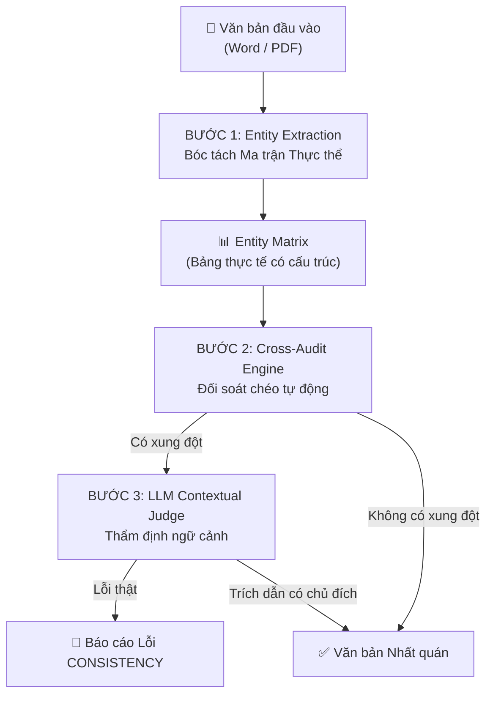

# 🔍 PAIP — Document Consistency Check Architecture

> **Version:** 1.0  
> **Status:** Draft Architecture / Chờ phê duyệt triển khai  
> **Category:** Core Capability / Rule Engine Level 2  
> **Module Path:** `PAIP/core/rule_engine/rules/consistency_rule.py`  
> **Related Docs:** [[Rule_Engine_Architecture]], [[Agent_0_Document_Proofreader]], [[Feedback_Learning_Architecture]]

---

## 1. Tổng quan & Bối cảnh (Problem Statement)

Trong thực tế vận hành PTSC, một tỷ lệ lớn lỗi nghiêm trọng trong văn bản thương mại và hành chính **KHÔNG PHẢI** lỗi chính tả — mà là **lỗi bất nhất thông tin nội tại (Internal Inconsistency)**:

| Dạng lỗi             | Ví dụ thực tế tại PTSC                                                 | Hậu quả                 |
| -------------------- | ---------------------------------------------------------------------- | ----------------------- |
| Sai số hiệu văn bản  | Header: `43/TMCG-TKE`, Phụ lục đính kèm: `46/TMCG-TKE`                 | Văn bản vô hiệu pháp lý |
| Sai lệch tên đối tác | Đầu HĐ ghi "Công ty A", Điều 5 ghi "Công ty B" (copy mẫu cũ)           | Tranh chấp hợp đồng     |
| Sai lệch số tiền     | Số: `150.000.000 VNĐ`, Chữ: "Một trăm năm mươi hai triệu đồng"         | Thiệt hại tài chính     |
| Nghịch lý thời gian  | Ngày ban hành sau Hạn nộp; Bảo hành Mục 7: 12 tháng, Phụ lục: 24 tháng | Vô hiệu điều khoản      |
| Tham chiếu "ma"      | "Căn cứ Điều 15..." nhưng toàn văn bản chỉ có đến Điều 10              | Lỗi logic, mất uy tín   |
| Tổng con ≠ Tổng cộng | Bảng kê 3 dòng cộng lại ≠ dòng Tổng cộng cuối bảng                     | Sai sót số liệu         |
| % thanh toán > 100%  | Đợt 1: 30% + Đợt 2: 50% + Đợt 3: 30% = 110%                            | Rủi ro tài chính        |

Các lỗi này **LLM rất khó tự phát hiện** khi đọc từng câu riêng lẻ (vì từng câu đều đúng ngữ pháp). Cần một bộ máy chuyên biệt trích xuất, cấu trúc hóa và đối soát chéo.

---

## 2. Kiến trúc Tổng thể — Entity Matrix & Cross-Audit Pipeline

### 2.1. Mô hình 3 Bước (Three-Stage Pipeline)



### 2.2. Chi phí & Hiệu năng từng bước

| Bước | Công nghệ | Chi phí API | Thời gian |
|---|---|:---:|:---:|
| **Bước 1:** Entity Extraction | Python Regex + NLP thuật toán | **0 đồng** | 2 – 10 ms |
| **Bước 2:** Cross-Audit Engine | Logic toán học / ma trận Python | **0 đồng** | < 1 ms |
| **Bước 3:** LLM Contextual Judge | Gemini Flash / GPT-4o-mini *(chỉ gọi khi có cờ)* | **~ 0 – 50 VNĐ** | 0.5 – 1.5s |

> **Tổng chi phí:** Gần như 0 đồng cho đa số văn bản. Chỉ phát sinh vài chục đồng khi có điểm nghi vấn cần LLM xác nhận.

---

## 3. Bước 1: Entity Extraction — Bóc tách Ma trận Thực thể

### 3.1. Các nhóm thực thể cần bóc tách (Entity Groups)

```python
class EntityType(str, Enum):
    DOCUMENT_CODE = "document_code"      # Số hiệu VB: 43/TMCG-TKE, QĐ-2026/01
    DATE = "date"                        # Ngày tháng: 06/08/2026, ngày 15 tháng 7
    MONEY_NUMBER = "money_number"        # Số tiền bằng số: 150.000.000 VNĐ
    MONEY_WORDS = "money_words"          # Số tiền bằng chữ: Một trăm năm mươi triệu
    PARTY_NAME = "party_name"            # Tên đối tác/bên ký: Công ty CP ABC
    PERSON_NAME = "person_name"          # Tên người đại diện: Ông Nguyễn Văn A
    PERCENTAGE = "percentage"            # Tỷ lệ phần trăm: 30%, 50%
    DURATION = "duration"                # Thời hạn: 12 tháng, 4 tuần, 30 ngày
    CLAUSE_REF = "clause_ref"            # Tham chiếu điều khoản: Điều 15, Mục 3.2
    WARRANTY = "warranty"                # Bảo hành: 12 tháng, 24 tháng
```

### 3.2. Regex Patterns (Ví dụ minh họa)

```python
PATTERNS = {
    "document_code": r"(?:số|Số)\s*(\d{1,4}\s*/\s*[A-ZĐa-zđ\-]+(?:\s*/\s*[A-Za-z\-]+)?)",
    "date": r"(?:ngày|Ngày)\s*(\d{1,2})\s*/\s*(\d{1,2})\s*/\s*(\d{4})",
    "money_number": r"(\d{1,3}(?:[.,]\d{3})+)\s*(?:VNĐ|đồng|VND|USD|\$)",
    "money_words": r"((?:Một|Hai|Ba|Bốn|Năm|Sáu|Bảy|Tám|Chín|Mười|Mươi|Trăm|Nghìn|Ngàn|Triệu|Tỷ|Lẻ|Không)[\s,]*)+đồng",
    "percentage": r"(\d{1,3}(?:[.,]\d+)?)\s*%",
    "clause_ref": r"(?:Điều|Mục|Khoản)\s+(\d+(?:\.\d+)?)",
}
```

### 3.3. Output: Entity Matrix (Bảng Thực thể)

Sau khi quét, hệ thống tạo một bảng dữ liệu có cấu trúc:

```json
{
  "document_codes": [
    {"value": "43/TMCG-TKE", "location": "Header (trang 1, dòng 3)", "section": "header"},
    {"value": "46/TMCG-TKE", "location": "Phụ lục (trang 2, dòng 1)", "section": "attachment"}
  ],
  "dates": [
    {"value": "06/08/2026", "label": "Ngày ban hành", "section": "header"},
    {"value": "08/08/2026", "label": "Hạn nộp hồ sơ", "section": "body"}
  ],
  "money_pairs": [
    {"number": "150000000", "words": "Một trăm năm mươi hai triệu", "section": "body"}
  ],
  "percentages": [
    {"value": 30, "label": "Đợt 1", "section": "payment_schedule"},
    {"value": 50, "label": "Đợt 2", "section": "payment_schedule"},
    {"value": 30, "label": "Đợt 3", "section": "payment_schedule"}
  ]
}
```

---

## 4. Bước 2: Cross-Audit Engine — Quy tắc Đối soát

### 4.1. Danh mục Quy tắc Đối soát (Audit Rules)

| ID | Tên quy tắc | Logic kiểm tra | Mức cảnh báo |
|---|---|---|---|
| `CA-001` | Document Code Consistency | Nếu cùng 1 loại mã (cùng suffix `-TKE`) xuất hiện > 1 số khác nhau → 🚩 | `ERROR` |
| `CA-002` | Money Number vs Words | Chuyển đổi số tiền bằng chữ thành số, so khớp với giá trị bằng số → 🚩 nếu lệch | `ERROR` |
| `CA-003` | Timeline Logic | Nếu `Ngày ban hành > Hạn nộp` → 🚩 Nghịch lý thời gian | `ERROR` |
| `CA-004` | Duration Consistency | Nếu cùng một khái niệm (bảo hành, giao hàng) xuất hiện > 1 giá trị khác nhau → 🚩 | `WARNING` |
| `CA-005` | Payment % Total | Nếu tổng % các đợt thanh toán ≠ 100% → 🚩 | `ERROR` |
| `CA-006` | Table Sum Check | Nếu tổng cộng cuối bảng ≠ sum các dòng con → 🚩 | `ERROR` |
| `CA-007` | Ghost Clause Reference | Nếu tham chiếu "Điều X" mà X > số Điều tối đa trong văn bản → 🚩 | `WARNING` |
| `CA-008` | Party Name Consistency | Nếu tên đối tác/người đại diện khác nhau giữa các section → 🚩 | `WARNING` |

### 4.2. Output: Conflict Report

```json
{
  "conflicts": [
    {
      "rule_id": "CA-001",
      "rule_name": "Document Code Consistency",
      "severity": "ERROR",
      "details": "Số hiệu văn bản bất nhất: Header ghi '43/TMCG-TKE' nhưng Phụ lục ghi '46/TMCG-TKE'",
      "entities": [
        {"value": "43/TMCG-TKE", "location": "Header trang 1"},
        {"value": "46/TMCG-TKE", "location": "Phụ lục trang 2"}
      ]
    }
  ]
}
```

---

## 5. Bước 3: LLM Contextual Judge — Thẩm định Ngữ cảnh

Chỉ khi Bước 2 phát hiện xung đột, hệ thống mới gọi LLM với một prompt ngắn gọn:

```
Bạn là chuyên gia thẩm định văn bản doanh nghiệp. Hệ thống phát hiện điểm bất nhất sau:

XUNG ĐỘT: Số hiệu văn bản ở Header là "43/TMCG-TKE" nhưng ở Phụ lục đính kèm ghi "46/TMCG-TKE".
NGỮ CẢNH: [Đoạn văn bản xung quanh vùng xung đột]

Câu hỏi: Đây là lỗi copy-paste/gõ nhầm hay là trích dẫn văn bản khác có chủ đích?
Trả lời: {"is_error": true/false, "explanation": "...", "suggested_fix": "..."}
```

> **Chi phí:** Chỉ gửi ~200 tokens (vài chục đồng VNĐ), không gửi toàn bộ văn bản.

---

## 6. Tích hợp vào Pipeline Hiện tại của Agent 0

```
  Văn bản đầu vào
        │
        ▼
  ┌─────────────────┐
  │ Level 1: Glossary│  ← Đã có (Từ điển chuyên ngành)
  │     Rule         │
  └────────┬────────┘
           │
           ▼
  ┌─────────────────┐
  │ Level 2: Consis- │  ← MỚI (Entity Matrix + Cross-Audit)
  │   tency Rule     │
  └────────┬────────┘
           │
           ▼
  ┌─────────────────┐
  │ LLM Inference   │  ← Đã có (Soát chính tả, ngữ pháp, pháp lý)
  │ (Agent 0 Prompt) │     + Tiêm thêm conflict warnings vào Prompt
  └────────┬────────┘
           │
           ▼
  ┌─────────────────┐
  │ Merge & Report  │  ← Gộp: Glossary + Consistency + LLM errors
  └─────────────────┘
```

---

## 7. Cấu trúc Code Đề xuất

```text
PAIP/core/rule_engine/
├── rules/
│   ├── glossary_rule.py          # [Level 1] Đã có ✅
│   ├── consistency_rule.py       # [Level 2] MỚI — Entity Matrix + Cross-Audit
│   └── format_rule.py            # [Level 2] Tương lai — Thể thức NĐ30
│
├── extractors/                    # MỚI — Bóc tách thực thể
│   ├── __init__.py
│   ├── base_extractor.py         # BaseEntityExtractor interface
│   ├── document_code.py          # Bóc số hiệu văn bản
│   ├── money_extractor.py        # Bóc số tiền (số + chữ) & đối soát
│   ├── date_extractor.py         # Bóc ngày tháng & kiểm tra logic
│   ├── party_extractor.py        # Bóc tên đối tác, người đại diện
│   └── clause_ref_extractor.py   # Bóc tham chiếu điều khoản
│
├── auditors/                      # MỚI — Bộ đối soát chéo
│   ├── __init__.py
│   ├── base_auditor.py           # BaseAuditor interface
│   ├── code_auditor.py           # CA-001: So khớp mã số
│   ├── money_auditor.py          # CA-002: So khớp tiền số vs chữ
│   ├── timeline_auditor.py       # CA-003: Kiểm tra logic thời gian
│   ├── percentage_auditor.py     # CA-005: Kiểm tra tổng %
│   └── table_sum_auditor.py      # CA-006: Kiểm tra tổng bảng
```

---

## 8. CSDL Hỗ trợ

Sử dụng bảng `system_rules` trong CSDL hiện tại (đã có sẵn từ [[Database_Architecture]]):

```sql
-- Lưu cấu hình các Audit Rule (bật/tắt, severity)
INSERT INTO system_rules (rule_code, rule_type, description, severity, is_active)
VALUES 
  ('CA-001', 'consistency', 'Document Code Consistency', 'ERROR', true),
  ('CA-002', 'consistency', 'Money Number vs Words', 'ERROR', true),
  ('CA-003', 'consistency', 'Timeline Logic', 'ERROR', true);
```

---

## 9. Lộ trình Triển khai

- [ ] **Phase 1:** Xây dựng `extractors/` — Bộ bóc tách Document Code, Money, Date.
- [ ] **Phase 2:** Xây dựng `auditors/` — Bộ đối soát CA-001, CA-002, CA-003.
- [ ] **Phase 3:** Xây dựng `consistency_rule.py` — Điều phối pipeline 3 bước.
- [ ] **Phase 4:** Tích hợp vào `RuleEngine` pipeline và Agent 0 Prompt.
- [ ] **Phase 5:** Mở rộng thêm các auditor: Party Name, Clause Reference, Table Sum.
