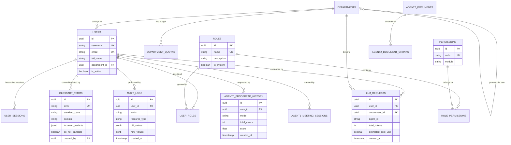

# 🏛️ PAIP — Enterprise Database Architecture Specification

> **Version:** 1.0  
> **Status:** Implemented & Production Ready (Đã triển khai, nạp CSDL & vượt qua 42/42 unit/integration tests)  
> **Category:** Core Infrastructure / Persistence & Scaling  
> **Target Database Engine:** PostgreSQL 16+ (Dev/Local: SQLite Async via SQLAlchemy)  
> **ORM & Migration:** SQLAlchemy 2.0 (Async) + Alembic  
> **Related Architecture Docs:** [[PAIP_Architecture]], [[Rule_Engine_Architecture]], [[LDAP_Auth_Architecture]]

---

## 1. Tổng quan & Tầm nhìn Thiết kế (Design Philosophy)

Để đảm bảo PAIP phát triển bền vững từ **Agent 0** đến **hệ sinh thái Multi-Agent (Agent 1 Meeting, Agent 2 RAG, Agent 3 Procurement)**, kiến trúc CSDL được thiết kế theo các nguyên tắc chuẩn doanh nghiệp:

1. **Domain-Driven Modular Schemas (Phân rã theo nghiệp vụ):** Chia thành 4 nhóm bảng độc lập: *System & Rules*, *Auth & RBAC*, *Audit & Telemetry*, và *Agents Data*.
2. **PostgreSQL-Native + AI-Ready:** Tận dụng tối đa các tính năng hiện đại của PostgreSQL:
   - `JSONB` cho cấu hình động, prompt template, và kết quả phân tích AI.
   - `pgvector` sẵn sàng cho bài toán RAG (Vector Search) của Agent 2 và Agent 3 mà không cần cài thêm Vector DB ngoài.
   - `Partitioning` (phân vùng theo tháng) cho bảng `audit_logs` và `llm_requests` khi dữ liệu phình to lên hàng triệu bản ghi.
3. **Database-Agnostic qua SQLAlchemy 2.0 Async:** 100% code Python sử dụng Async ORM. Môi trường Dev chạy SQLite nhẹ nhàng, môi trường Production cắm thẳng vào PostgreSQL Enterprise mà không sửa 1 dòng code.
4. **Auditability & Compliance (Minh bạch & Kiểm toán):** Mọi thao tác thay đổi từ điển, sửa quy tắc, gọi AI đều được định danh theo User/Department và lưu vào Audit Trail.

---

## 2. Sơ đồ Quan hệ Thực thể Tổng thể (Mermaid ER Diagram)



---

## 3. Chi tiết Thiết kế 4 Phân hệ Bảng (Database Schemas)

---

### 📁 Phân hệ 1: System & Rules (Quản trị Quy chuẩn & Từ điển)

Quản lý kho từ điển chuyên ngành PTSC, các luật tĩnh (Level 1, 2, 3) và cấu hình toàn hệ thống.

#### Bảng `glossary_terms` (Kho từ điển chuyên ngành)
| Tên cột | Kiểu dữ liệu | Ràng buộc | Mô tả |
|---|---|---|---|
| `id` | `UUID` | `PRIMARY KEY, DEFAULT gen_random_uuid()` | Khóa chính |
| `term` | `VARCHAR(100)` | `UNIQUE, NOT NULL, INDEX` | Thuật ngữ chuẩn (VD: 'FPSO') |
| `standard_case` | `VARCHAR(100)` | `NOT NULL` | Cách viết hoa/thường chuẩn |
| `full_name_vi` | `VARCHAR(255)` | `NULL` | Tên đầy đủ Tiếng Việt |
| `full_name_en` | `VARCHAR(255)` | `NULL` | Tên đầy đủ Tiếng Anh |
| `domain` | `VARCHAR(50)` | `NOT NULL, INDEX` | Lĩnh vực (Offshore, HSEQ, EPC, Corporate...) |
| `incorrect_variants` | `JSONB` | `NOT NULL, DEFAULT '[]'` | Mảng các biến thể sai để Regex bắt lỗi |
| `synonyms` | `JSONB` | `NOT NULL, DEFAULT '[]'` | Mảng từ đồng nghĩa |
| `do_not_translate` | `BOOLEAN` | `NOT NULL, DEFAULT true` | Cấm LLM dịch sang tiếng Việt |
| `description` | `TEXT` | `NULL` | Giải thích ngữ nghĩa nghiệp vụ |
| `is_active` | `BOOLEAN` | `NOT NULL, DEFAULT true` | Bật/tắt sử dụng |
| `created_by` | `UUID` | `FOREIGN KEY -> users(id), NULL` | Người tạo |
| `created_at` | `TIMESTAMP WITH TIME ZONE` | `NOT NULL, DEFAULT NOW()` | Thời gian tạo |
| `updated_at` | `TIMESTAMP WITH TIME ZONE` | `NOT NULL, DEFAULT NOW()` | Thời gian sửa |

#### Bảng `system_rules` (Quy tắc kiểm tra mở rộng Level 2 & 3)
| Tên cột       | Kiểu dữ liệu               | Ràng buộc                     | Mô tả                              |
| ------------- | -------------------------- | ----------------------------- | ---------------------------------- |
| `id`          | `UUID`                     | `PRIMARY KEY`                 | Khóa chính                         |
| `rule_code`   | `VARCHAR(50)`              | `UNIQUE, NOT NULL`            | Mã luật (VD: 'ND30_HEADER_FORMAT') |
| `rule_type`   | `VARCHAR(30)`              | `NOT NULL`                    | `GLOSSARY`, `FORMAT`, `PROCESS`    |
| `name`        | `VARCHAR(200)`             | `NOT NULL`                    | Tên hiển thị của luật              |
| `config_json` | `JSONB`                    | `NOT NULL`                    | Cấu hình tham số của luật          |
| `severity`    | `VARCHAR(20)`              | `NOT NULL, DEFAULT 'WARNING'` | `INFO`, `WARNING`, `ERROR`         |
| `priority`    | `INT`                      | `NOT NULL, DEFAULT 100`       | Thứ tự ưu tiên thực thi            |
| `is_enabled`  | `BOOLEAN`                  | `NOT NULL, DEFAULT true`      | Bật/tắt luật                       |
| `created_at`  | `TIMESTAMP WITH TIME ZONE` | `DEFAULT NOW()`               | Ngày tạo                           |
| `updated_at`  | `TIMESTAMP WITH TIME ZONE` | `DEFAULT NOW()`               | Ngày sửa                           |

#### Bảng `system_settings` (Cấu hình hệ thống động)
| Tên cột | Kiểu dữ liệu | Ràng buộc | Mô tả |
|---|---|---|---|
| `key` | `VARCHAR(100)` | `PRIMARY KEY` | Khóa cấu hình (VD: 'DEFAULT_LLM_MODEL') |
| `value_json` | `JSONB` | `NOT NULL` | Giá trị cấu hình (chuỗi, số, object) |
| `description` | `TEXT` | `NULL` | Giải thích tác dụng của cấu hình |
| `updated_by` | `UUID` | `FOREIGN KEY -> users(id)` | Người cập nhật gần nhất |
| `updated_at` | `TIMESTAMP WITH TIME ZONE` | `DEFAULT NOW()` | Thời gian cập nhật |

---

### 📁 Phân hệ 2: Auth & RBAC (Xác thực, Phân quyền & Phòng ban)

Tích hợp Microsoft Entra ID / LDAP nội bộ, phân quyền RBAC đa cấp và cấu trúc phòng ban PTSC.

#### Bảng `departments` (Cơ cấu tổ chức PTSC)
| Tên cột | Kiểu dữ liệu | Ràng buộc | Mô tả |
|---|---|---|---|
| `id` | `UUID` | `PRIMARY KEY` | Khóa chính |
| `code` | `VARCHAR(50)` | `UNIQUE, NOT NULL` | Mã phòng ban (P.ATCL, P.KTTB, P.TM, XN.CL...) |
| `name` | `VARCHAR(200)` | `NOT NULL` | Tên đầy đủ phòng ban |
| `parent_id` | `UUID` | `FOREIGN KEY -> departments(id), NULL` | Cây phân cấp cha/con (Tổng cty -> Đơn vị -> Ban) |
| `is_active` | `BOOLEAN` | `DEFAULT true` | Đang hoạt động |
| `created_at` | `TIMESTAMP WITH TIME ZONE` | `DEFAULT NOW()` | Ngày tạo |

#### Bảng `users` (Tài khoản người dùng)
| Tên cột | Kiểu dữ liệu | Ràng buộc | Mô tả |
|---|---|---|---|
| `id` | `UUID` | `PRIMARY KEY` | Khóa chính |
| `username` | `VARCHAR(100)` | `UNIQUE, NOT NULL, INDEX` | Tên đăng nhập (đồng bộ LDAP `sAMAccountName`) |
| `email` | `VARCHAR(255)` | `UNIQUE, NOT NULL` | Email công ty (`@ptsc.com.vn`) |
| `full_name` | `VARCHAR(200)` | `NOT NULL` | Họ và tên |
| `title` | `VARCHAR(100)` | `NULL` | Chức vụ (Trưởng phòng, Chuyên viên...) |
| `department_id` | `UUID` | `FOREIGN KEY -> departments(id), NULL` | Thuộc phòng ban nào |
| `is_active` | `BOOLEAN` | `DEFAULT true` | Trạng thái tài khoản |
| `is_superuser` | `BOOLEAN` | `DEFAULT false` | Quản trị viên tối cao hệ thống |
| `last_login_at` | `TIMESTAMP WITH TIME ZONE` | `NULL` | Lần đăng nhập gần nhất |
| `created_at` | `TIMESTAMP WITH TIME ZONE` | `DEFAULT NOW()` | Ngày tạo |
| `updated_at` | `TIMESTAMP WITH TIME ZONE` | `DEFAULT NOW()` | Ngày sửa |

#### Bảng `roles` & `permissions` & Bảng trung gian
- **`roles`:** `id`, `name` (ADMIN, DEPT_LEAD, SPECIALIST, VIEWER), `description`, `is_system`.
- **`permissions`:** `id`, `code` (`glossary:read`, `glossary:edit`, `proofread:run`, `telemetry:view`, `admin:all`), `name`, `module`.
- **`role_permissions`:** `role_id (FK)`, `permission_id (FK)` — Composite PK.
- **`user_roles`:** `user_id (FK)`, `role_id (FK)`, `assigned_at`, `assigned_by (FK)` — Composite PK.
- **`user_sessions`:** `id`, `user_id (FK)`, `refresh_token_hash`, `ip_address`, `user_agent`, `expires_at`, `is_revoked`.

---

### 📁 Phân hệ 3: Audit & Telemetry (Giám sát, Nhật ký & Quản lý Chi phí)

Đảm bảo an ninh, minh bạch quy trình và kiểm soát ngân sách token AI của từng phòng ban.

#### Bảng `audit_logs` (Nhật ký kiểm toán hệ thống)
*(Khuyến nghị Table Partitioning theo tháng trên PostgreSQL)*
| Tên cột | Kiểu dữ liệu | Ràng buộc | Mô tả |
|---|---|---|---|
| `id` | `UUID` | `PRIMARY KEY` | Khóa chính |
| `user_id` | `UUID` | `FOREIGN KEY -> users(id), NULL` | Ai thực hiện |
| `action` | `VARCHAR(100)` | `NOT NULL, INDEX` | Hành động: `CREATE_TERM`, `DELETE_TERM`, `LOGIN`, `UPDATE_RULE` |
| `resource_type` | `VARCHAR(50)` | `NOT NULL, INDEX` | Đối tượng: `glossary`, `rule`, `user`, `config` |
| `resource_id` | `VARCHAR(100)` | `NULL` | ID của đối tượng bị tác động |
| `old_values` | `JSONB` | `NULL` | Dữ liệu trước khi sửa |
| `new_values` | `JSONB` | `NULL` | Dữ liệu sau khi sửa |
| `ip_address` | `VARCHAR(50)` | `NULL` | Địa chỉ IP của client |
| `created_at` | `TIMESTAMP WITH TIME ZONE` | `NOT NULL, DEFAULT NOW(), INDEX` | Thời điểm ghi log |

#### Bảng `llm_requests` (Thống kê tiêu thụ AI & Chi phí)
| Tên cột | Kiểu dữ liệu | Ràng buộc | Mô tả |
|---|---|---|---|
| `id` | `UUID` | `PRIMARY KEY` | Khóa chính |
| `user_id` | `UUID` | `FOREIGN KEY -> users(id), NULL` | Người gửi yêu cầu |
| `department_id` | `UUID` | `FOREIGN KEY -> departments(id), NULL` | Phòng ban chịu chi phí |
| `agent_id` | `VARCHAR(50)` | `NOT NULL, INDEX` | `agent_0_proofreader`, `agent_1_meeting`... |
| `provider` | `VARCHAR(30)` | `NOT NULL` | `gemini`, `openai`, `local_vllm` |
| `model_name` | `VARCHAR(100)` | `NOT NULL` | Model cụ thể (`gemini-1.5-flash`, `gpt-4o`...) |
| `prompt_tokens` | `INT` | `NOT NULL, DEFAULT 0` | Số token đầu vào |
| `completion_tokens` | `INT` | `NOT NULL, DEFAULT 0` | Số token đầu ra |
| `total_tokens` | `INT` | `NOT NULL, DEFAULT 0` | Tổng token |
| `latency_ms` | `FLOAT` | `NOT NULL` | Thời gian phản hồi (ms) |
| `estimated_cost_usd` | `DECIMAL(10,6)` | `NOT NULL, DEFAULT 0` | Chi phí ước tính (USD) |
| `status` | `VARCHAR(20)` | `NOT NULL` | `SUCCESS`, `ERROR`, `TIMEOUT` |
| `error_message` | `TEXT` | `NULL` | Chi tiết lỗi nếu có |
| `created_at` | `TIMESTAMP WITH TIME ZONE` | `NOT NULL, DEFAULT NOW(), INDEX` | Thời điểm thực hiện |

#### Bảng `department_quotas` (Hạn mức ngân sách AI phòng ban)
| Tên cột | Kiểu dữ liệu | Ràng buộc | Mô tả |
|---|---|---|---|
| `id` | `UUID` | `PRIMARY KEY` | Khóa chính |
| `department_id` | `UUID` | `FOREIGN KEY -> departments(id), UNIQUE` | Phòng ban |
| `monthly_budget_usd` | `DECIMAL(10,2)` | `NOT NULL, DEFAULT 50.00` | Ngân sách tối đa/tháng (USD) |
| `current_month_usage_usd`| `DECIMAL(10,2)` | `NOT NULL, DEFAULT 0.00` | Số tiền đã dùng trong tháng |
| `alert_threshold_percent`| `INT` | `DEFAULT 80` | Cảnh báo khi chạm 80% ngân sách |
| `is_hard_limit` | `BOOLEAN` | `DEFAULT false` | Có chặn gọi AI khi vượt quá ngân sách không |
| `updated_at` | `TIMESTAMP WITH TIME ZONE` | `DEFAULT NOW()` | Ngày cập nhật |

---

### 📁 Phân hệ 4: Agents Workspaces & Dữ liệu Tác vụ (Dài hạn)

Lưu trữ lịch sử xử lý của từng Agent, phục vụ tái tra cứu và RAG Vector Search.

#### Bảng `agent0_proofread_history` (Lịch sử rà soát văn bản của Agent 0)
| Tên cột | Kiểu dữ liệu | Ràng buộc | Mô tả |
|---|---|---|---|
| `id` | `UUID` | `PRIMARY KEY` | Khóa chính |
| `user_id` | `UUID` | `FOREIGN KEY -> users(id)` | Người rà soát |
| `filename` | `VARCHAR(255)` | `NULL` | Tên file Word/PDF nếu có |
| `mode` | `VARCHAR(30)` | `NOT NULL` | `standard`, `formal`, `strict`, `legal` |
| `char_count` | `INT` | `NOT NULL` | Số ký tự văn bản |
| `total_errors` | `INT` | `NOT NULL` | Tổng số lỗi phát hiện |
| `score` | `FLOAT` | `NOT NULL` | Điểm chất lượng văn bản (1.0 - 10.0) |
| `violations_summary`| `JSONB` | `NOT NULL` | Thống kê số lượng lỗi theo từng type |
| `processing_time_ms`| `FLOAT` | `NOT NULL` | Thời gian xử lý tổng cộng |
| `created_at` | `TIMESTAMP WITH TIME ZONE` | `DEFAULT NOW(), INDEX` | Ngày rà soát |

#### Bảng `agent1_meeting_sessions` (Dành cho Agent 1 — Tóm tắt cuộc họp)
- `id`, `user_id (FK)`, `title`, `audio_file_path`, `duration_seconds`, `transcript_text`, `summary_markdown`, `action_items (JSONB)`, `created_at`.

#### Bảng `agent2_documents` & `agent2_document_chunks` (Dành cho Agent 2 — RAG Quy trình với `pgvector`)
- **`agent2_documents`:** `id`, `title`, `doc_type` (Quy chế, Hướng dẫn, Quy trình), `file_path`, `file_hash`, `created_at`.
- **`agent2_document_chunks`:** `id`, `document_id (FK)`, `chunk_index`, `content_text`, `embedding vector(768)` *(Postgres pgvector)*, `metadata_json (JSONB)`.

---

## 4. Chiến lược Đánh Chỉ mục (Indexing Strategy) để Scale-Up

Để khi dữ liệu đạt hàng triệu dòng vẫn phản hồi < 10ms:

1. **`glossary_terms`:**
   - B-Tree Index trên `term` (Unique) và `domain`.
   - GIN Index trên cột `incorrect_variants` (`CREATE INDEX idx_glossary_variants ON glossary_terms USING GIN (incorrect_variants);`) để truy vấn JSON siêu tốc.
2. **`audit_logs` & `llm_requests`:**
   - Composite Index trên `(created_at, user_id)` và `(created_at, department_id)` để kết xuất báo cáo nhanh.
3. **`users`:**
   - Unique Index trên `username` và `email`.

---

## 5. Lộ trình Triển khai Kỹ thuật (Phased Implementation Roadmap)

```
Giai đoạn 1: Foundation DB & Glossary Migration (BẮT ĐẦU KHI ĐƯỢC LỆNH)
├── Tạo thư mục `core/database/` (Async Engine, Session Factory, Base Model)
├── Tạo Model `GlossaryTermModel` và bảng `glossary_terms`
├── Viết script tự động nạp (Seed) 24 từ mẫu từ `glossary.json` vào DB
└── Cập nhật RuleEngine load dữ liệu từ DB (vẫn quét Regex RAM < 1ms)

Giai đoạn 2: Auth & RBAC Schema
├── Tạo Model `User`, `Role`, `Permission`, `Department`, `Session`
├── Viết Migration Script (Alembic)
└── Sẵn sàng cho Module LDAP Integration cắm vào

Giai đoạn 3: Telemetry & Audit Logs
├── Tạo Model `AuditLog`, `LLMRequest`, `DepartmentQuota`
└── Gắn middleware tự động ghi nhận Token/Cost sau mỗi lượt AI gọi
```

---

## 6. Kết luận & Trạng thái

- Tài liệu kiến trúc này được bảo lưu trong Kho tri thức Obsidian: `Architecture/Database_Architecture.md`.
- **Trạng thái:** Thiết kế đã hoàn chỉnh 100%, sẵn sàng thực thi khi có chỉ thị từ cấp trên.
