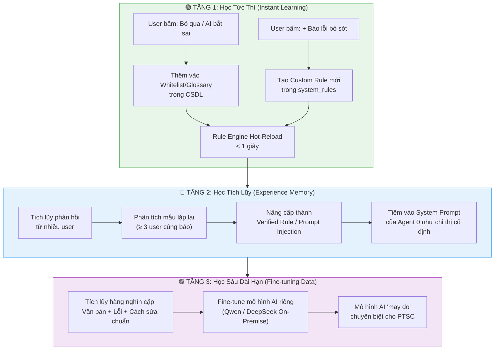

# 🧠 PAIP — Feedback & Self-Learning Architecture

> **Version:** 1.0  
> **Status:** Draft Architecture / Chờ phê duyệt triển khai  
> **Category:** Core Capability / AI Continuous Improvement  
> **Module Path:** `PAIP/core/feedback/`  
> **Related Docs:** [[Rule_Engine_Architecture]], [[Consistency_Check_Architecture]], [[Agent_0_Document_Proofreader]], [[Database_Architecture]]

---

## 1. Tổng quan & Triết lý (Design Philosophy)

> **"AI chỉ thực sự thông minh khi được dạy bởi chính những người sử dụng nó hàng ngày."**

Không có mô hình AI nào (GPT-4o, Gemini, Claude) có thể hiểu 100% quy ước nội bộ, văn hóa hành văn và thuật ngữ đặc thù của PTSC nếu không có phản hồi từ chuyên viên thực tế.

**Feedback & Self-Learning** là hệ thống giúp:
1. **Người dùng dạy AI** khi AI bắt nhầm hoặc bỏ sót lỗi.
2. **AI tự cải thiện** theo thời gian thông qua 3 cấp độ học tập.
3. **Tích lũy tài sản dữ liệu nội bộ** để huấn luyện mô hình riêng của PTSC trong tương lai.

---

## 2. Mô hình 3 Tầng Học Tập (Three-Tier Learning Model)



---

## 3. Tầng 1: Học Tức Thì — Instant Learning (Tác dụng < 1 giây)

### 3.1. Kịch bản 1: AI bắt lỗi sai (False Positive)

**Tình huống:** AI báo từ "FPSO" là lỗi chính tả và gợi ý sửa thành "Fpso". User biết đây là thuật ngữ chuẩn.

**Hành động của User trên giao diện:**
- Bấm nút **[❌ Bỏ qua — AI sai]** trên lỗi cụ thể đó.
- Tùy chọn bấm thêm **[+ Thêm vào Whitelist]** để bảo vệ vĩnh viễn.

**Hệ thống xử lý:**
1. Ghi phản hồi vào bảng `user_feedback` trong CSDL.
2. Nếu user chọn "Thêm Whitelist" → Ghi vào bảng `glossary_terms` → Rule Engine hot-reload.
3. **Kết quả:** Kể từ giây tiếp theo, toàn bộ người dùng trong công ty sẽ không bao giờ gặp lỗi báo nhầm này nữa.

### 3.2. Kịch bản 2: AI bỏ sót lỗi (False Negative)

**Tình huống:** Văn bản có lỗi "số 46/TMCG" thay vì "số 43/TMCG" nhưng AI không phát hiện.

**Hành động của User trên giao diện:**
- Bấm nút **[+ Báo lỗi AI bỏ sót]** ở cuối kết quả soát lỗi.
- Điền form nhanh:
  - **Đoạn bị sai:** `số 46/TMCG-TKE`
  - **Nên sửa thành:** `số 43/TMCG-TKE`
  - **Phân loại:** `Bất nhất số hiệu văn bản`
  - **Ghi chú (tùy chọn):** `Số hiệu ở phụ lục phải khớp Header`

**Hệ thống xử lý:**
1. Ghi vào bảng `user_corrections`.
2. Phân tích dạng lỗi → Nếu là dạng có thể tạo Rule tự động (ví dụ: Cross-reference check) → Kích hoạt/tạo `ConsistencyRule` tương ứng.
3. **Kết quả:** Lần quét sau, Rule Engine sẽ tự động bắt lỗi tương tự mà không cần gọi LLM.

---

## 4. Tầng 2: Học Tích Lũy — Experience Memory

### 4.1. Cơ chế "Bỏ phiếu" từ nhiều User (Crowd-Verified Learning)

```
User A báo lỗi bỏ sót "Bất nhất số hiệu" → count = 1
User B báo lỗi tương tự ở văn bản khác    → count = 2
User C báo lỗi tương tự                    → count = 3 ✅ Đạt ngưỡng!
         ↓
Hệ thống tự động nâng cấp thành "Verified Rule"
         ↓
Tiêm vào System Prompt của Agent 0:
"LUÔN đối chiếu số hiệu văn bản giữa Header và Phụ lục đính kèm."
```

### 4.2. Dynamic Few-Shot Learning (Học từ Ví dụ Mẫu)

Khi user bấm **[✅ Chấp nhận sửa]** trên một gợi ý của AI:
- Hệ thống lưu cặp `(original_text, corrected_text)` vào `experience_memory`.
- Khi AI quét văn bản tương tự trong tương lai, hệ thống tự động bốc ra **2-3 ví dụ sửa mẫu chuẩn nhất** (theo domain/department) tiêm vào prompt dạng Few-shot:

```
VÍ DỤ THAM KHẢO TỪ CHUYÊN VIÊN PTSC:
- Sai: "Căn cứ theo nghị định số 30/NĐ-CP" → Đúng: "Căn cứ Nghị định số 30/2020/NĐ-CP"
- Sai: "fpso" → Đúng: "FPSO"
Hãy áp dụng chuẩn mực tương tự khi soát văn bản dưới đây.
```

### 4.3. Bảng trọng số tin cậy (Trust Score)

Mỗi user có một **Trust Score** dựa trên:
- Số lần phản hồi được các user khác đồng thuận.
- Vai trò trong tổ chức (Trưởng phòng > Nhân viên mới).
- Chuyên môn domain (User thuộc P.PCHT phản hồi về từ điển Pháp chế có trọng số cao hơn).

---

## 5. Tầng 3: Học Sâu Dài Hạn — Fine-tuning Dataset

### 5.1. Tự động xây dựng Training Dataset

Sau 3-6 tháng vận hành, hệ thống tự động tổng hợp:

```json
{
  "training_pairs": [
    {
      "input": "Căn cứ theo nghị định số 30/NĐ-CP về thể thức văn bản...",
      "expected_output": {
        "errors": [
          {
            "type": "legal",
            "original": "nghị định số 30/NĐ-CP",
            "suggested": "Nghị định số 30/2020/NĐ-CP",
            "explanation": "Thiếu năm ban hành, viết thường 'nghị định'"
          }
        ]
      },
      "verified_by": ["user_lucbui", "user_vunguyenanh"],
      "department": "P.TKE",
      "confidence": 0.95
    }
  ]
}
```

### 5.2. Ứng dụng Fine-tuning

Dữ liệu này được sử dụng để:
- **Fine-tune Qwen 2.5 / DeepSeek V3** chạy On-Premise tại máy chủ PTSC.
- Mô hình sau fine-tune sẽ hiểu chính xác văn phong, thuật ngữ và quy ước nội bộ PTSC mà không cần tiêm dài dòng vào prompt.

---

## 6. Thiết kế CSDL cho Feedback System

### 6.1. Bảng `user_feedback` — Phản hồi trên từng lỗi

```sql
CREATE TABLE user_feedback (
    id UUID PRIMARY KEY DEFAULT gen_random_uuid(),
    -- Liên kết
    proofread_history_id UUID REFERENCES agent0_proofread_history(id),
    user_id UUID REFERENCES users(id),
    -- Nội dung phản hồi
    error_index INTEGER,                    -- Lỗi thứ mấy trong danh sách
    action TEXT NOT NULL,                    -- 'accept' | 'reject' | 'modify'
    user_correction TEXT,                    -- Cách sửa của user (nếu khác AI)
    -- Metadata
    created_at TIMESTAMPTZ DEFAULT NOW()
);
```

### 6.2. Bảng `user_corrections` — Báo lỗi AI bỏ sót

```sql
CREATE TABLE user_corrections (
    id UUID PRIMARY KEY DEFAULT gen_random_uuid(),
    user_id UUID REFERENCES users(id),
    -- Nội dung
    document_snippet TEXT NOT NULL,          -- Đoạn văn bản chứa lỗi
    error_text TEXT NOT NULL,                -- Phần bị sai
    suggested_fix TEXT NOT NULL,             -- Cách sửa đúng
    error_category TEXT NOT NULL,            -- 'consistency' | 'spelling' | 'terminology' | 'legal'
    notes TEXT,                              -- Ghi chú thêm
    -- Trạng thái xử lý
    status TEXT DEFAULT 'pending',           -- 'pending' | 'verified' | 'promoted' | 'rejected'
    verified_count INTEGER DEFAULT 1,        -- Số user đồng thuận
    promoted_to_rule BOOLEAN DEFAULT false,  -- Đã nâng cấp thành Rule chưa
    rule_id UUID REFERENCES system_rules(id),-- Link tới Rule đã tạo (nếu có)
    -- Metadata
    created_at TIMESTAMPTZ DEFAULT NOW()
);
```

### 6.3. Bảng `experience_memory` — Ký ức kinh nghiệm (Few-shot)

```sql
CREATE TABLE experience_memory (
    id UUID PRIMARY KEY DEFAULT gen_random_uuid(),
    -- Nội dung
    pattern_category TEXT NOT NULL,          -- 'glossary' | 'consistency' | 'legal' | 'formatting'
    original_text TEXT NOT NULL,             -- Đoạn văn gốc
    corrected_text TEXT NOT NULL,            -- Đoạn văn đã sửa chuẩn
    explanation TEXT,                        -- Giải thích tại sao sửa
    -- Trọng số
    domain TEXT,                             -- 'Offshore', 'EPC', 'Corporate'...
    department TEXT,                         -- 'P.TKE', 'P.ATCL'...
    trust_score FLOAT DEFAULT 1.0,          -- Điểm tin cậy (tăng theo số user đồng thuận)
    usage_count INTEGER DEFAULT 0,          -- Số lần được tiêm vào prompt
    -- Metadata
    contributed_by UUID REFERENCES users(id),
    created_at TIMESTAMPTZ DEFAULT NOW()
);
```

---

## 7. Luồng Dữ liệu Tổng thể (Data Flow)

```
                    ┌─────────────────────────────────────────────────┐
                    │              GIAO DIỆN NGƯỜI DÙNG               │
                    │                                                 │
                    │  Kết quả soát lỗi:                              │
                    │  ┌───────────────────────────────────────────┐  │
                    │  │ Lỗi 1: "fpso" → "FPSO"                   │  │
                    │  │   [✅ Chấp nhận]  [❌ Bỏ qua]  [✏️ Sửa] │  │
                    │  │                                           │  │
                    │  │ Lỗi 2: "nghị định 30" → "Nghị định 30"   │  │
                    │  │   [✅ Chấp nhận]  [❌ Bỏ qua]  [✏️ Sửa] │  │
                    │  └───────────────────────────────────────────┘  │
                    │                                                 │
                    │  [+ Báo lỗi AI bỏ sót]  [👍👎 Đánh giá chung]  │
                    └──────────────────────┬──────────────────────────┘
                                           │
                              ┌────────────┴────────────┐
                              ▼                         ▼
                    ┌──────────────────┐     ┌──────────────────────┐
                    │  user_feedback   │     │  user_corrections    │
                    │  (Phản hồi lỗi)  │     │  (Lỗi AI bỏ sót)    │
                    └────────┬─────────┘     └──────────┬───────────┘
                             │                          │
                    ┌────────┴──────────────────────────┴───────────┐
                    │         FEEDBACK PROCESSOR (Background Job)    │
                    │                                                │
                    │  1. Cập nhật glossary_terms (Whitelist)         │
                    │  2. Tạo/kích hoạt system_rules (Custom Rules)  │
                    │  3. Tích lũy experience_memory (Few-shot)      │
                    │  4. Phân tích verified_count → Promote to Rule │
                    └───────────────────────────────────────────────┘
```

---

## 8. API Endpoints Đề xuất

| Method | Path | Mô tả |
|---|---|---|
| `POST` | `/api/v1/feedback/error` | User phản hồi (accept/reject/modify) trên 1 lỗi cụ thể |
| `POST` | `/api/v1/feedback/report-missed` | User báo lỗi AI bỏ sót |
| `POST` | `/api/v1/feedback/rate` | User đánh giá tổng thể (👍👎 + ghi chú) |
| `GET` | `/api/v1/feedback/stats` | Thống kê phản hồi: tỷ lệ accept/reject, top lỗi bỏ sót |
| `GET` | `/api/v1/feedback/pending-rules` | Danh sách corrections đang chờ nâng cấp thành Rule |
| `POST` | `/api/v1/feedback/promote/{id}` | Admin phê duyệt nâng cấp correction thành Rule chính thức |

---

## 9. Lộ trình Triển khai

- [ ] **Phase 1: UI Feedback Buttons** — Thêm nút ✅❌✏️ trên từng lỗi và nút [+ Báo lỗi bỏ sót] trên giao diện.
- [ ] **Phase 2: Backend API & DB Tables** — Tạo bảng `user_feedback`, `user_corrections`, `experience_memory` và API endpoints.
- [ ] **Phase 3: Instant Learning** — Kết nối nút "Thêm Whitelist" trực tiếp vào `glossary_terms` + Rule Engine hot-reload.
- [ ] **Phase 4: Experience Memory** — Xây dựng Feedback Processor tự động phân tích, tích lũy và tiêm Few-shot vào Prompt.
- [ ] **Phase 5: Crowd Verification** — Logic bỏ phiếu đồng thuận (verified_count ≥ 3) → Auto-promote thành Verified Rule.
- [ ] **Phase 6: Fine-tuning Export** — Công cụ xuất Training Dataset chuẩn cho Fine-tune mô hình nội bộ.
