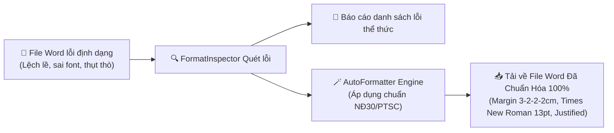

# 📐 PAIP — Document Format & Layout Inspection Architecture

> **Version:** 1.0  
> **Status:** Draft Architecture / Knowledge Base Updated  
> **Category:** Core Capability / Rule Engine Level 2 (Structural & Layout Rules)  
> **Module Path:** `PAIP/core/rule_engine/rules/format_rule.py`  
> **Related Docs:** [[Rule_Engine_Architecture]], [[Consistency_Check_Architecture]], [[Agent_0_Document_Proofreader]]

---

## 1. Tổng quan & Tầm quan trọng (Executive Overview)

Trong môi trường doanh nghiệp nhà nước và tập đoàn dầu khí như PTSC/PVN, một văn bản (Tờ trình, Hợp đồng, Thư mời chào giá, Quyết định, Báo cáo kỹ thuật) dù có nội dung hay đến đâu nhưng nếu **trình bày sai lề, lỗi font chữ, cỡ chữ chắp vá hoặc không căn đều 2 bên** sẽ bị đánh giá là **thiếu chuyên nghiệp** hoặc bị phòng Văn thư / Ban Lãnh đạo **trả lại yêu cầu soạn lại**.

Các quy định này được chuẩn hóa theo:
1. **Nghị định 30/2020/NĐ-CP** của Chính phủ về công tác văn thư.
2. **Quy chế Công tác Văn thư & Bộ Nhận diện Thương hiệu của Tổng công ty PTSC / PVN**.

---

## 2. Tại sao AI / LLM Không thể Kiểm tra Định dạng?

```
[ File Word (.docx) ] 
       │ 
       ├─► (Trích xuất Text thuần) ──► [ LLM / GPT ] ──► "MÙ" hoàn toàn về Font, Cỡ chữ, Căn lề, Căn dòng!
       │
       └─► (Đọc Cây XML/AST Styling) ─► [ FormatInspector ] ──► Bắt chính xác 100% từng mm, từng pt (< 10ms, 0đ)!
```

- Khi trích xuất nội dung văn bản thành chuỗi ký tự (plain text) để gửi cho LLM, toàn bộ thông tin về **Font, Size (pt), Margins (cm), Spacing (line), Alignment (Justify/Left), Bold/Italic** đều bị xóa bỏ.
- Do đó, việc kiểm tra định dạng **BẮT BUỘC** phải xử lý bằng module chuyên biệt ở tầng **Docx AST / OpenXML Inspector** thông qua thư viện `python-docx`.

---

## 3. Danh mục Bộ Quy chuẩn Kiểm tra Thể thức (Formatting Specifications)

### 3.1. Căn lề Trang giấy Khổ A4 (Page Margins) theo Nghị định 30/2020/NĐ-CP

| Thông số lề | Chuẩn Nghị định 30 / PTSC | Dung sai cho phép | Hành vi vi phạm phổ biến |
|---|---|---|---|
| **Lề trái (Left)** | **$30 - 35\text{ mm}$ ($3.0 - 3.5\text{ cm}$)** | $\pm 1\text{ mm}$ | Để mặc định Word ($2.54\text{ cm}$) $\rightarrow$ Bị lẹm chữ khi đóng gáy/bấm lỗ. |
| **Lề phải (Right)** | **$15 - 20\text{ mm}$ ($1.5 - 2.0\text{ cm}$)** | $\pm 1\text{ mm}$ | Để lề phải quá sát ($< 1.5\text{ cm}$) hoặc quá rộng ($> 2.5\text{ cm}$). |
| **Lề trên (Top)** | **$20 - 25\text{ mm}$ ($2.0 - 2.5\text{ cm}$)** | $\pm 1\text{ mm}$ | Header đè sát mép trên. |
| **Lề dưới (Bottom)** | **$20 - 25\text{ mm}$ ($2.0 - 2.5\text{ cm}$)** | $\pm 1\text{ mm}$ | Footer hoặc số trang tràn mép dưới. |

---

### 3.2. Quy chuẩn Font & Cỡ chữ (Typography Consistency)

- **Bộ mã & Font chữ bắt buộc:** Bắt buộc sử dụng font **Times New Roman** (Bộ mã Unicode chuẩn TCVN 6909:2001).
- **Phát hiện Font "rác" (Font Leakage):** Quét toàn bộ `runs` trong tài liệu để phát hiện các đoạn bị dính font lạ (`Calibri`, `Arial`, `Segoe UI`, `Tahoma`...) do người soạn copy-paste từ Website, Báo giá Email hoặc Zalo sang Word.
- **Phát hiện Cỡ chữ chắp vá (Size Inconsistency):** Cảnh báo nếu các đoạn văn cùng cấp (Body) bị lệch cỡ chữ (ví dụ đoạn trên `13pt`, đoạn dưới `12pt` hoặc `14pt`).

---

### 3.3. Quy chuẩn Thể thức Từng Khối Cấu trúc (Document Block Rules)

| Thành phần văn bản                                               | Font & Cỡ chữ chuẩn (pt) | Kiểu chữ (Style)                         | Căn lề (Alignment)                     |
| ---------------------------------------------------------------- | ------------------------ | ---------------------------------------- | -------------------------------------- |
| **Quốc hiệu** (*CỘNG HÒA XÃ HỘI CHỦ NGHĨA VIỆT NAM*)             | `12 - 13 pt`             | In hoa, Đứng, **Đậm**                    | Căn giữa (Center)                      |
| **Tiêu ngữ** (*Độc lập - Tự do - Hạnh phúc*)                     | `13 - 14 pt`             | Chữ thường, Đứng, **Đậm**, có gạch ngang | Căn giữa (Center)                      |
| **Tên cơ quan/đơn vị ban hành** (*PTSC QNG / TỔNG CÔNG TY PTSC*) | `12 - 13 pt`             | In hoa, Đứng, **Đậm**                    | Căn giữa (Center)                      |
| **Số, ký hiệu văn bản** (*Số: 43/TMCG-TKE*)                      | `13 pt`                  | Chữ thường, Đứng                         | Căn giữa theo tên đơn vị               |
| **Địa danh & Ngày tháng** (*Quảng Ngãi, ngày 06/08/2026*)        | `13 - 14 pt`             | Chữ thường, *Nghiêng*                    | Căn giữa theo Tiêu ngữ                 |
| **Tên loại VB & Trích yếu** (*THƯ MỜI CHÀO GIÁ...*)              | `14 - 15 pt`             | In hoa, Đứng, **Đậm**                    | Căn giữa (Center)                      |
| **Nội dung văn bản (Body)**                                      | `13 - 14 pt`             | Chữ thường, Đứng                         | **Bắt buộc Căn đều 2 bên (Justified)** |
| **Chức danh người ký** (*GIÁM ĐỐC / TRƯỞNG PHÒNG*)               | `13 - 14 pt`             | In hoa, Đứng, **Đậm**                    | Căn giữa khối ký (Right-Center)        |
| **Nơi nhận (Distribution list)**                                 | `11 - 12 pt`             | In hoa/thường, Đứng/Nghiêng              | Căn trái (Left)                        |

---

### 3.4. Căn dòng & Giãn đoạn (Spacing & Alignment)

- **Căn lề khối nội dung (Paragraph Alignment):** Toàn bộ đoạn văn nội dung bắt buộc phải là **Căn đều hai bên (Justify / Both)**. Nếu người soạn để *Align Left* (căn trái) làm thụt thò mép phải ➔ Báo lỗi `FORMAT_ALIGNMENT`.
- **Thụt đầu dòng (First Line Indent):** Bắt buộc thụt đầu dòng từ `1.0 - 1.27 cm` (1/2 inch) cho mỗi đoạn văn mới.
- **Giãn dòng (Line Spacing):** Chuẩn `1.15` đến `1.5 lines` (tuyệt đối không để `Single` gây dính chữ hoặc `Double` quá loãng).
- **Giãn đoạn (Paragraph Spacing):** `Space Before: 0pt`, `Space After: 6pt` (hoặc cách dòng hợp lý).

---

## 4. Kiến trúc Kỹ thuật Module `FormatRule`

```
PAIP/core/rule_engine/
├── rules/
│   ├── glossary_rule.py          # [Level 1] Từ điển chuyên ngành ✅
│   ├── consistency_rule.py       # [Level 2] Tính nhất quán số liệu 🔜
│   └── format_rule.py            # [Level 2] Thể thức & Trình bày (MỚI)
│
└── format_inspector/             # Bộ máy phân tích định dạng chuyên sâu
    ├── __init__.py
    ├── inspector.py              # DocxFormatInspector chính
    ├── margin_checker.py         # Kiểm tra lề trang A4 (mm/cm)
    ├── typography_checker.py     # Kiểm tra Font Times New Roman, Size pt, Font rác
    ├── alignment_checker.py      # Kiểm tra Justify, Indent, Line Spacing
    ├── block_structure_checker.py# Kiểm tra Thể thức Quốc hiệu, Tiêu ngữ, Chữ ký
    └── auto_formatter.py         # 🪄 Tự động chuẩn hóa file Word và xuất ra .docx mới
```

---

## 5. Danh mục Mã Quy tắc Thể thức (Format Rule Codes)

| Mã Rule | Tên quy tắc | Mô tả chi tiết | Mức cảnh báo |
|---|---|---|---|
| `FMT-001` | **Page Margin Left** | Lề trái nhỏ hơn $3.0\text{ cm}$ (không đủ khoảng cách đóng gáy) | `WARNING` |
| `FMT-002` | **Page Margin Top/Bottom/Right** | Lề trên/dưới/phải nằm ngoài dải quy định Nghị định 30 | `INFO` |
| `FMT-003` | **Font Family Inconsistency** | Phát hiện đoạn văn dính font khác `Times New Roman` (Calibri, Arial...) | `WARNING` |
| `FMT-004` | **Body Alignment Not Justified** | Đoạn văn nội dung không được căn đều 2 bên (Justified) | `WARNING` |
| `FMT-005` | **Font Size Mismatch** | Cỡ chữ nội dung bị lệch (ví dụ đoạn 12pt xen lẫn 13pt/14pt) | `WARNING` |
| `FMT-006` | **Heading Not Uppercase Bold** | Tiêu đề văn bản / Tên loại văn bản không viết hoa in đậm | `WARNING` |
| `FMT-007` | **Line Spacing Violation** | Giãn dòng quá hẹp ($< 1.0$) hoặc quá rộng ($> 1.5$) | `INFO` |
| `FMT-008` | **Signer Block Missing Bold** | Chức danh người ký không viết hoa in đậm | `INFO` |

---

## 6. Tính năng Cao cấp: "1-Click Auto-Format Document"

Ngoài việc **báo lỗi**, hệ thống cung cấp tính năng **Tự động Sửa & Chuẩn hóa Định dạng**:



### Cách thức hoạt động:
1. Người dùng tải lên file `.docx` bị lỗi định dạng.
2. Bấm nút **[🪄 Tự động Chuẩn hóa theo Thể thức PTSC]**.
3. Module `auto_formatter.py` tự động can thiệp vào file:
   - Sửa lề trang về chuẩn: Top `2.0cm`, Bottom `2.0cm`, Left `3.0cm`, Right `1.5cm`.
   - Chuyển toàn bộ font về `Times New Roman`.
   - Chuyển toàn bộ đoạn thân văn bản về cỡ `13pt`, căn đều `Justified`, thụt dòng `1.27cm`.
   - Giãn dòng chuẩn `1.15 lines`, `after_spacing = 6pt`.
4. Người dùng tải về file hoàn hảo trong chưa đầy **1 giây**!

---

## 7. Lộ trình Triển khai Module Thể thức

- [ ] **Bước 1:** Xây dựng `DocxFormatInspector` đọc trực tiếp `python-docx` Document XML.
- [ ] **Bước 2:** Xây dựng các checker độc lập (`margin_checker`, `typography_checker`, `alignment_checker`).
- [ ] **Bước 3:** Tích hợp `FormatRule` vào `RuleEngine` và trả về danh sách lỗi thể thức trên giao diện.
- [ ] **Bước 4:** Xây dựng công cụ `AutoFormatter` cho phép tải về bản Word đã được chuẩn hóa tự động 1-Click.
