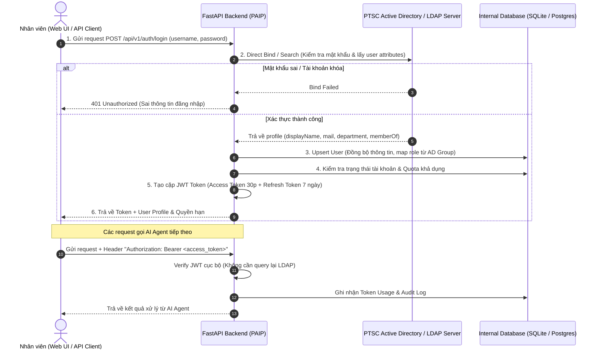

# 🔐 Kế hoạch & Kiến trúc Tích hợp LDAP / Active Directory (Auth & DB Spec)

> **Dự án:** PAIP — PTSC AI Platform  
> **Trạng thái:** Sẵn sàng triển khai (Ready for Implementation)  
> **Tài liệu tham chiếu:** `PTSC_AI_RnD/Architecture/PAIP_Architecture.md`  
> **Source Code Spec:** `PAIP/docs/LDAP_AUTH_SPEC.md`

---

## 1. Tổng quan & Mục tiêu

Tích hợp xác thực tập trung thông qua máy chủ **LDAP / Active Directory (AD)** của PTSC kết hợp **JWT (JSON Web Token)** và **Cơ sở dữ liệu nội bộ (Local DB)** để đạt được:
- ✅ **Đăng nhập một lần (Single Sign-On)** bằng tài khoản nội bộ công ty (sAMAccountName hoặc email).
- ✅ **Cơ chế JIT Provisioning (Just-In-Time)**: Tự động đồng bộ và tạo tài khoản vào DB nội bộ ở lần đăng nhập đầu tiên.
- ✅ **Quản lý Hạn mức & Chi phí AI (Cost & Quota Tracking)**: Theo dõi token OpenAI / Gemini / Claude tiêu thụ theo từng user/phòng ban.
- ✅ **Phân quyền chi tiết (RBAC)**: Map các nhóm từ Active Directory (`memberOf`) sang vai trò nội bộ của PAIP.
- ✅ **Lịch sử & Audit Log**: Ghi nhận hoạt động truy cập và sử dụng AI Agent để đảm bảo an toàn thông tin doanh nghiệp.

---

## 2. Sơ đồ Kiến trúc & Luồng xác thực



---

## 3. Thiết kế Cơ sở dữ liệu (Database Schema)

Database sử dụng **SQLAlchemy / SQLModel** (hỗ trợ SQLite cho dev và PostgreSQL cho production).

### 3.1. Bảng `users`
| Cột | Kiểu | Mô tả |
|---|---|---|
| `id` | Integer (PK) | Khóa chính tự tăng |
| `username` | String (Unique, Index) | Khớp với `sAMAccountName` trên Active Directory |
| `email` | String (Index) | Email nội bộ (VD: `anhnv@ptsc.com.vn`) |
| `full_name` | String | Họ tên nhân viên (VD: Nguyễn Văn Anh) |
| `department` | String | Phòng ban (VD: Phòng Pháp chế, Ban Đấu thầu) |
| `title` | String | Chức danh / Vị trí |
| `role` | String (Enum) | `admin`, `lead_reviewer`, `standard_user` |
| `is_active` | Boolean | Trạng thái kích hoạt (Default: `True`) |
| `is_local_admin` | Boolean | Tài khoản quản trị nội bộ fallback (Default: `False`) |
| `hashed_password` | String (Nullable) | Chỉ dùng cho local fallback admin |
| `monthly_quota_usd` | Float | Hạn mức chi phí AI tối đa / tháng (Default: `10.0`) |
| `created_at` | DateTime | Thời gian tạo tài khoản |
| `last_login_at` | DateTime | Thời gian đăng nhập gần nhất |

### 3.2. Bảng `token_usages`
| Cột | Kiểu | Mô tả |
|---|---|---|
| `id` | Integer (PK) | Khóa chính |
| `user_id` | Integer (FK `users.id`) | Người thực hiện |
| `agent_name` | String | Tên agent (e.g. `agent_0_proofreader`) |
| `provider` | String | `gemini`, `openai`, `anthropic` |
| `model` | String | Tên model (e.g. `gemini-2.5-flash`) |
| `input_tokens` | Integer | Số lượng prompt tokens |
| `output_tokens` | Integer | Số lượng completion tokens |
| `cost_usd` | Float | Chi phí ước tính theo USD |
| `created_at` | DateTime | Thời điểm gọi LLM |

### 3.3. Bảng `audit_logs`
| Cột | Kiểu | Mô tả |
|---|---|---|
| `id` | Integer (PK) | Khóa chính |
| `user_id` | Integer (FK `users.id`) | Người thao tác |
| `action` | String | Hành động (`LOGIN`, `UPLOAD_FILE`, `RUN_PROOFREAD`) |
| `resource` | String | Tên file / endpoint xử lý |
| `ip_address` | String | Địa chỉ IP người dùng |
| `status` | String | `SUCCESS` hoặc `FAILED` |
| `details` | Text / JSON | Chi tiết lỗi hoặc thông tin bổ sung |
| `created_at` | DateTime | Thời gian ghi log |

---

## 4. Cấu hình biến môi trường (`.env`)

```env
# ============================================================
# LDAP / Active Directory Configuration
# ============================================================
LDAP_SERVER_URI=ldaps://dc.ptsc.com.vn:636
LDAP_BASE_DN=DC=ptsc,DC=com,DC=vn
LDAP_BIND_USER_DN=CN=svc_paip,OU=ServiceAccounts,DC=ptsc,DC=com,DC=vn
LDAP_BIND_USER_PASSWORD=your-service-account-password
LDAP_USER_SEARCH_FILTER=(|(sAMAccountName={username})(mail={username}))
LDAP_USE_TLS=true
LDAP_CONNECT_TIMEOUT=5

# Role Mapping từ AD Group sang PAIP Role
LDAP_ADMIN_GROUPS=CN=AI_Admins,OU=Groups,DC=ptsc,DC=com,DC=vn
LDAP_REVIEWER_GROUPS=CN=Legal_Reviewers,OU=Groups,DC=ptsc,DC=com,DC=vn

# ============================================================
# JWT Security
# ============================================================
JWT_SECRET_KEY=generate-a-super-secret-64-character-hex-key-here
JWT_ALGORITHM=HS256
ACCESS_TOKEN_EXPIRE_MINUTES=60
REFRESH_TOKEN_EXPIRE_DAYS=7

# ============================================================
# Database Configuration
# ============================================================
DATABASE_URL=sqlite:///./paip.db
```

---

## 5. Kế hoạch triển khai từng bước (Execution Checklist)

- [ ] **Bước 1**: Cập nhật `requirements.txt` (`ldap3`, `pyjwt`, `passlib`, `bcrypt`, `sqlalchemy`, `aiosqlite`) và chạy `pip install`.
- [ ] **Bước 2**: Xây dựng module database `core/db/session.py` và `core/db/models.py`.
- [ ] **Bước 3**: Xây dựng LDAP Service `core/auth/ldap_client.py` (hỗ trợ cả Live AD và Mock Mode cho dev).
- [ ] **Bước 4**: Xây dựng JWT Utility `core/auth/jwt_handler.py`.
- [ ] **Bước 5**: Xây dựng FastAPI Security Dependencies `core/auth/dependencies.py`.
- [ ] **Bước 6**: Xây dựng Router `api/routers/auth.py` (`/login`, `/refresh`, `/me`, `/logout`).
- [ ] **Bước 7**: Bảo vệ các endpoint Agent và tự động ghi log `token_usages` & `audit_logs`.
