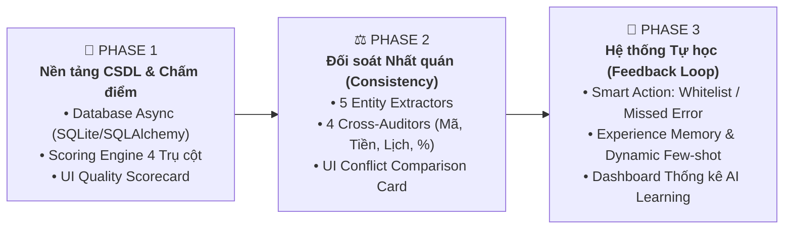

# 📋 Kế Hoạch Triển Khai Chi Tiết — Tiến Hóa Toàn Diện Agent 0 (Master Implementation Plan)

> **Dự án:** PAIP — PTSC AI Platform  
> **Module:** Agent 0 — Document Proofreader & Quality Engine  
> **Trạng thái:** Đã phê duyệt / Sẵn sàng triển khai theo Phase  
> **Tài liệu tham chiếu:**  
> - [[Agent_0_Document_Proofreader]]  
> - [[Consistency_Check_Architecture]]  
> - [[Feedback_Learning_Architecture]]  
> - [[Database_Architecture]]  
> - [[Format_Inspection_Architecture]]  
> - [[Rule_Engine_Architecture]]

---

## 1. Tầm nhìn & Mục tiêu Phát triển

Nâng cấp Agent 0 từ một công cụ rà soát chính tả đơn thuần thành **Bộ Máy Thẩm Định Chất Lượng & Đối Soát Văn Bản Doanh Nghiệp Toàn Diện**:
1. **Thẩm định Thể thức (Decree 30):** Căn lề, Font chữ, Căn đều Justified, 1-Click Auto-format. *(Đã hoàn thành ✅)*
2. **Nền tảng CSDL & Chấm điểm 4 Trụ cột:** Đánh giá chất lượng minh bạch, lưu trữ lịch sử và quản lý phản hồi.
3. **Đối soát Nhất quán & Số liệu (Consistency Cross-Audit):** Bắt lỗi sai lệch số hiệu, tiền số vs chữ, nghịch lý thời gian, % thanh toán, tổng cộng bảng.
4. **Hệ thống Tự học (Feedback & Self-Learning):** Tự động thông minh lên từ thao tác duyệt của nhân viên (Instant Whitelist, Few-shot memory, Fine-tuning dataset).

---

## 2. Lộ trình Phân chia 3 Phase Triển Khai

---

## 3. Chi Tiết Từng Phase Triển Khai

### 🚀 PHASE 1: Nền Tảng CSDL & Bảng Chấm Điểm 4 Trụ Cột (Database & Scoring Engine)
* **Thời gian dự kiến:** 1 – 2 ngày
* **Mục tiêu:** Xây dựng khung lưu trữ Database và công thức chấm điểm chất lượng minh bạch.

#### 📝 Danh mục công việc:
- [ ] **1.1. Cấu hình CSDL Async (SQLAlchemy 2.0 + SQLite/Postgres):**
  - Khởi tạo kết nối DB tại `core/database/session.py`.
  - Tạo các Model ORM:
    - `system_rules`: Lưu các quy tắc kiểm tra (Glossary, Consistency, Format).
    - `user_feedback`: Lưu hành động của user trên từng lỗi (accept/reject/modify).
    - `user_corrections`: Lưu các lỗi do user báo AI bỏ sót.
    - `experience_memory`: Lưu kho ví dụ mẫu (Few-shot) phục vụ tự học.
- [ ] **1.2. Xây dựng Scoring Engine chuẩn hóa (`core/scoring/engine.py`):**
  - Công thức tính điểm trừ thực tế dựa trên dữ liệu thật:
    - 🔤 *Chính tả & Ngữ pháp:* Trừ 0.2 – 0.5 đ/lỗi (tối đa 10đ).
    - 📐 *Thể thức NĐ 30:* Trừ 1.0 – 2.0 đ nếu sai lề / font / căn dòng (tối đa 10đ).
    - 🏢 *Thuật ngữ PTSC:* Trừ 1.0 đ/lỗi viết sai quy chuẩn nhận diện (tối đa 10đ).
    - ⚖️ *Nhất quán & Số liệu:* Trừ 2.0 đ/lỗi xung đột nghiêm trọng (tối đa 10đ).
  - Điểm tổng hợp trọng số: $Score = 0.25 \times S_{Spelling} + 0.25 \times S_{Format} + 0.25 \times S_{Glossary} + 0.25 \times S_{Consistency}$.
  - Phân loại trạng thái: `Xuất sắc (>=9.0)`, `Cần hiệu đính (7.0 - 8.9)`, `Chưa đạt chuẩn (<7.0)`.
- [ ] **1.3. Nâng cấp UI Quality Scorecard:**
  - Hiển thị bảng phân rã điểm 4 thanh tiến trình trực quan ở góc trái màn hình.
  - Badge trạng thái kiểm duyệt rõ ràng (*Đủ điều kiện ký duyệt / Cần hiệu đính*).

---

### ⚖️ PHASE 2: Triển Khai Module Đối Soát Nhất Quán (Consistency Check Engine)
* **Thời gian dự kiến:** 2 – 3 ngày
* **Mục tiêu:** Phát hiện các lỗi sai lệch số liệu, số hiệu văn bản và mâu thuẫn nội tại.

#### 📝 Danh mục công việc:
- [ ] **2.1. Xây dựng Bộ Bóc Tách Thực Thể (`core/rule_engine/extractors/`):**
  - `document_code.py`: Bóc tách số hiệu công văn / hợp đồng (Regex + Pattern).
  - `money_extractor.py`: Bóc tách số tiền bằng số (`150.000.000 VNĐ`) và bộ parser Tiếng Việt chuyển số tiền bằng chữ $\rightarrow$ số (`Một trăm năm mươi triệu đồng` $\rightarrow$ `150000000`).
  - `date_extractor.py`: Bóc tách ngày tháng năm (ngày ký, ngày ban hành, hạn nộp hồ sơ).
  - `percentage_extractor.py`: Bóc tách % các đợt thanh toán, tạm ứng, bảo lãnh.
  - `clause_ref_extractor.py`: Bóc tách tham chiếu Điều / Khoản / Mục.
- [ ] **2.2. Xây dựng Bộ Đối Soát Chéo (`core/rule_engine/auditors/`):**
  - `CA-001` (`code_auditor.py`): Đối soát số hiệu Header vs Phụ lục đính kèm.
  - `CA-002` (`money_auditor.py`): Đối soát Tiền số vs Tiền chữ (bắt lỗi lệch giá trị).
  - `CA-003` (`timeline_auditor.py`): Kiểm tra nghịch lý ngày ban hành > hạn nộp hồ sơ.
  - `CA-005` (`percentage_auditor.py`): Kiểm tra tổng % các đợt thanh toán phải $= 100\%$.
  - `CA-007` (`clause_auditor.py`): Bắt lỗi tham chiếu "Điều ma" (văn bản có 10 Điều nhưng trích dẫn Điều 15).
- [ ] **2.3. Tích hợp Consistency Rule (`core/rule_engine/rules/consistency_rule.py`):**
  - Điều phối pipeline: Extract $\rightarrow$ Audit $\rightarrow$ LLM Judge (chỉ khi có nghi vấn).
  - Tích hợp thành Level 2 trong `RuleEngine`.
- [ ] **2.4. Nâng cấp UI/UX:**
  - Thêm Filter Tab: `⚖️ Nhất quán / Số liệu (N)`.
  - Thiết kế **Conflict Comparison Card (Thẻ so khớp 2 vế)**: Hiển thị trực quan Vế A ⚡ Vế B kèm nút sửa 1-click.

---

### 🧠 PHASE 3: Triển Khai Hệ Thống Phản Hồi & Tự Học (Feedback & Self-Learning)
* **Thời gian dự kiến:** 2 – 3 ngày
* **Mục tiêu:** Biến Agent 0 thành hệ thống "Càng dùng càng thông minh" từ dữ liệu chuyên viên.

#### 📝 Danh mục công việc:
- [ ] **3.1. Nâng cấp Nút Thao Tác Thông Minh trên Thẻ Lỗi (Smart Card Actions):**
  - Nút `[✅ Áp dụng]`: Tự động ghi cặp câu chuẩn vào `experience_memory`.
  - Nút `[❌ Bỏ qua / AI Sai]`: Mở menu nhanh `[➕ Thêm vào Whitelist]`.
  - Cơ chế **Instant Learning**: Cập nhật `glossary_terms` trong DB $\rightarrow$ Hot-reload Rule Engine tức thì ($< 1$ giây).
- [ ] **3.2. Form Báo Lỗi AI Bỏ Sót (+ Report Missed Error):**
  - Modal form nhập nhanh lỗi bị bỏ sót (từ sai, từ đúng, phân loại).
  - Lưu vào bảng `user_corrections` để chuyên viên/admin rà soát.
- [ ] **3.3. Cơ chế Dynamic Few-Shot Learning:**
  - Khi Agent 0 rà soát văn bản mới, tự động query 2-3 ví dụ sửa mẫu tương tự nhất từ `experience_memory` tiêm vào System Prompt.
- [ ] **3.4. Dashboard & Quản Trị Tự Học:**
  - Bảng thống kê số lượng quy tắc AI đã tự học từ người dùng.
  - Chức năng Admin duyệt thăng hạng lỗi người dùng báo thành **Verified Rule**.
  - Script xuất Dataset chuẩn (JSONL) phục vụ Fine-tune mô hình On-Premise sau này.

---

## 4. Bảng Tiêu Chuẩn Nghiệm Thu (Acceptance Criteria)

| Phase | Tiêu chuẩn kỹ thuật | Kết quả kiểm thử mong đợi |
|---|---|---|
| **Phase 1** | Database async hoạt động trơn tru; Điểm số được tính bằng thuật toán minh bạch | 100% Unit test DB & Scoring pass; UI hiển thị Scorecard 4 thanh tiến trình |
| **Phase 2** | Bóc tách & đối soát chính xác 5 dạng thực thể; Bắt lỗi số tiền, mã số, timeline | Test trên các tài liệu mẫu có lỗi lệch tiền số/chữ & số hiệu phát hiện 100% |
| **Phase 3** | Bấm Thêm Whitelist có tác dụng ngay trong 1s; Prompt được tiêm Few-shot động | Bỏ qua từ viết tắt không bị bắt lại; Thống kê phản hồi cập nhật real-time |

---

## 5. Trạng Thái Cập Nhật Tiến Độ (Living Document)

* **2026-08-07:** Khởi tạo Master Plan, thống nhất phân chia 3 Phase rõ ràng.
* **Giai đoạn tiếp theo:** Bắt đầu khởi động **Phase 1 (Database & Scoring Engine)**.
